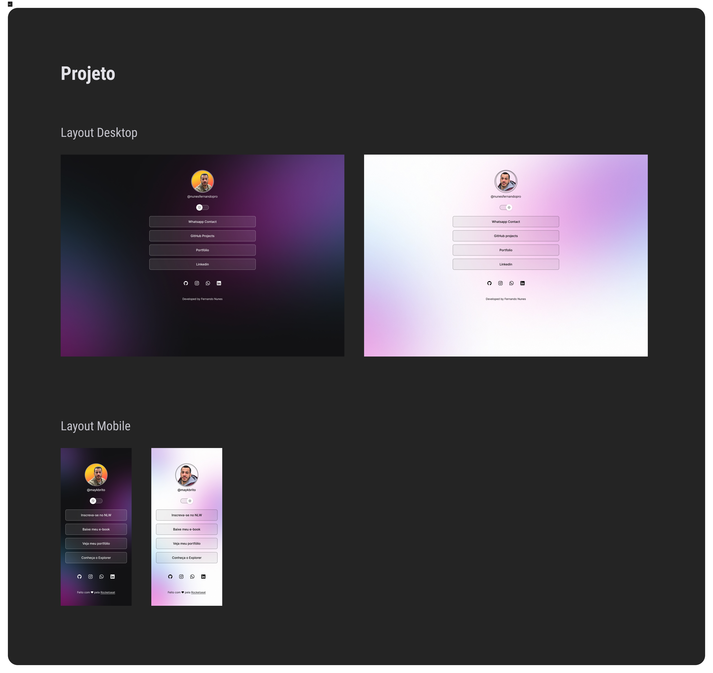

<h1 align="center"> Developer Links </h1>

This is a project for developing a portfolio.

  <a href="#-tecnology">Tecnology</a>&nbsp;&nbsp;&nbsp;|&nbsp;&nbsp;&nbsp;
  <a href="#-project">Project</a>&nbsp;&nbsp;&nbsp;|&nbsp;&nbsp;&nbsp;
  <a href="#-layout">Layout</a>&nbsp;&nbsp;&nbsp;|&nbsp;&nbsp;&nbsp;
  <a href="#memo-license">License</a>

  

 

  

## 🚀 Tecnology

This project was developed with the following technologies:

- HTML and CSS
- JavaScript
- Git and Github
- Figma

## 💻 Project

This is a project for developing a portfolio.

## 🔖 Layout

Você pode visualizar o layout do projeto através [DESSE LINK](https://www.figma.com/file/pCL4y5nFKBWxlG9d6qRR1l/DevLinks-%E2%80%A2-Projeto-Discover-(Community)?type=design&node-id=1439%3A736&t=Dtk5NpLPgV06PmTp-1). É necessário ter conta no [Figma](https://figma.com) para acessá-lo.

## :memo: License

This project is under the MIT license.

---

Developed by Fernando Nunes
